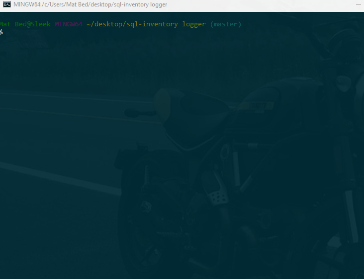

# Bamazon

An Amazon-like storefront using MySQL. The app takes in orders from customers and deplete stock from the store's inventory.

Running this application will first display all of the items available for sale. Included are the ids, names, and prices of products for sale.
The app will then prompt users with two messages.
The first ask them the ID of the product they would like to buy.
The second message should ask how many units of the product they would like to buy.

Once the customer has placed the order, application confirms product is in stock and reduces amount desired.
If product is not in stock, the app will let the customer know and then prevent the order from going through.

However, if the store does have enough of the product, app will fulfill the customer's order.

Once the update goes through, app will show the customer the total cost of their purchase.

### Prerequisites
You can run this app by cloning this repo and running the following command in your terminal. 

```
node bamazoncustomer.js
```


## Demo

